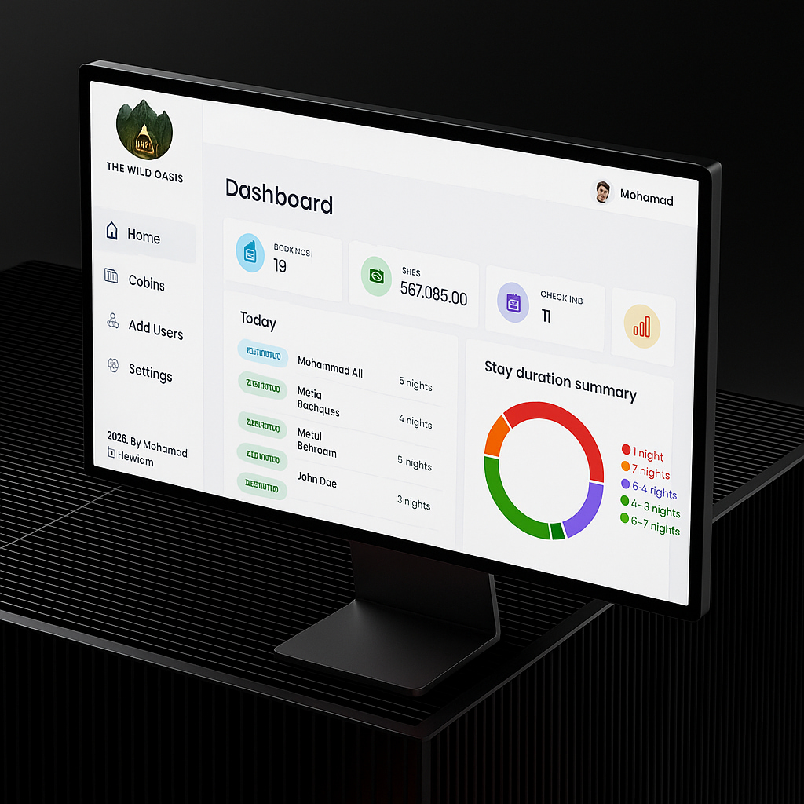

<h1 align="center">The Wild Oasis</h1>

<div align="center">
  
</div>

<br/>

<div align="center">
  The Wild Oasis solves critical operational challenges for boutique hotels by replacing scattered spreadsheets and legacy systems with an intuitive, real-time management dashboard. This MERN full-stack application delivers instant visibility into arrivals, departures, occupancy rates, and revenue performance—transforming chaotic hospitality operations into streamlined workflows. It simplifies daily operations through a secure, intuitive app and demonstrates modern best practices for building scalable, professional web applications.
</div>

<span id="live-demo"></span>

## 🚀 Live Demo

- **Client (Frontend):** Deployed on **Vercel**
- **Server (Backend):** Deployed on **Render**

👉 [View Website](https://...vercel.app)

---

### Table Of Contents

1. [Live Demo 🚀](#live-demo)
2. [How to Test the App 👨‍💻](#test-app)
3. [Key Features 🎯](#key-features)
4. [Technical Highlights 🚀](#technical-highlights)
5. [Technologies Used ⚙](#technologies-used)
6. [Project Structure 📂](#project-structure)
7. [Installation](#installation)

---

<span id="test-app"></span>

### How to Test the App 👨‍💻

To explore the application's features, you can log in with the following account:

- **Email:** mohamad10@gmail.com
- **Password:** Mhmd#test1

---

<span id="key-features"></span>

## Key Features 🎯

⭐ **Dashboard Overview**: Hotels generate large amounts of operational data. The dashboard turns this complexity into clarity by providing real-time charts and metrics, giving administrators instant insights into performance.

⭐ **Secure Authentication & Protected Routes**: Sensitive business data cannot be exposed. The system uses cookie-based authentication and protected routes to ensure only authorized staff can access administrative features.

⭐ **Cabin Management**: Full CRUD functionality for cabins makes it simple to add, edit, or remove cabins while keeping data consistent and organized.

⭐ **Booking Management**: The booking system efficiently tracks check-ins and stays, ensuring staff can respond quickly and accurately.

⭐ **Dark Mode**: Staff need tools that reduce strain during long hours. The user friendly design and dark mode deliver both accessibility and comfort.

⭐ **Hotel Settings**: Hotel policies often change. A dedicated admin-only settings panel allows adjustments like minimum nights or breakfast pricing without code changes.

---

<span id="technical-highlights"></span>

## Technical Highlights 🚀

- This project was built to demonstrate proficiency in creating professional-grade, scalable, and maintainable frontend applications by focusing on business and user outcomes.

👉 **Efficient Data Management with React Query**: Implemented **React Query** for a powerful data-fetching layer. This allows for seamless caching, background data synchronization, and optimistic UI updates, resulting in a lightning-fast and highly responsive user experience.

👉 **Robust State Management with Context API**: Leveraged **React Context API** for global state management, for dark mode ensuring a clean and predictable application state without the complexity of a larger state management library.

👉 **Type Safety with TypeScript**: Developed the frontend with **TypeScript** to catch errors early in the development process and ensure type safety, leading to a more robust and maintainable codebase.

👉 **Modern Styling with Tailwind CSS & CSS Modules**: Utilized **Tailwind CSS** for rapid and consistent UI development, while also using **CSS Modules** for component-specific styles to avoid global style conflicts and maintain a professional styling architecture.

👉 **Optimized Forms with React Hook Form**: Used **React Hook Form** to build highly optimized and performant forms. This library minimizes re-renders and provides a clean API for form validation and submission, leading to a smooth user experience.

👉 **Professional Project Structure**: The project is organized with a feature-driven architecture, separating code into logical directories like `features`, `pages`, and `ui`, which makes it scalable and easy for a team to navigate.

👉 **Seamless User Interactions**: Implemented **React Portals** for a professional and accessible modal experience and **React Hot Toast** for elegant, non-intrusive notifications.

👉 **Data Visualization**: Integrated **recharts** library to provide visually appealing and informative data insights on the dashboard, making it easy for administrators to interpret key metrics.

👉 **Secure Authentication Flow**: Created a robust authentication flow with **protected routes** to secure the admin dashboard, ensuring that only authenticated hotel staff can access sensitive data. The application uses a secure, cookie-based system for managing user sessions.

---

<span id="technologies-used"></span>

### Technologies Used ⚙️

### Frontend

- **React.js**
- **React Router**
- **React Query**
- **React Hook Form**
- **React Context API**
- **TypeScript**
- **Tailwind CSS**
- **CSS Modules**
- **React Hot Toast**
- **Recharts**

### Backend & Database

- **Node.js & Express.js**
- **MongoDB**
- **JWT & Cookies**
- **etc..**

---

<span id="project-structure"></span>

## Project Structure 📁

The project's folder structure is designed for clarity and maintainability, separating the core application logic into distinct, well-defined directories:

```bash
client/
├── node_modules/
├── public/
├── src/
│   ├── features/   # Components / hooks are organized by feature (e.g., cabins, authentication, dashboard ...)
│ ├── layout/ # Main app layout
│   ├── pages/      # Page-level components
│ ├── shared/ # Reusable assets across the application
│ │ ├── hooks/ # Reusable hooks for abstracting logic across the app
│ │ └── ui/ # Reusable UI components (buttons,Header,spinners etc...)
│   ├── context/    # Global state and providers
│   ├── styles/     # Global Css styles
│   ├── App.tsx     # Main application component
│   └── main.tsx    # Entry point for the React application
├── .env
├── .gitignore
└── package.json
```

---

<span id="installation"></span>

### **Installation**

1. Clone the repository:

```bash
git https://github.com/Mhmd-abi-hachem/admin-management-system-mern.git
```

2. Install the project dependencies using npm:

```bash
npm install
```

3. **Set Up Environment Variables**

Create a new file named .env in the root of both your client and server directories. Add your keys and URLs as needed for authentication, database connection, and payments.

- For **Client side**

```env
VITE_API_URL=your-api-path-url
```

- For **Server side**

```env
NODE_ENV=development
PORT=8000
CLIENT_URL=<your-client-path-url>

DATABASE_CONNECTION=<your_mongodb_connection_string>

JWT_SECRET_KEY=<your_jwt_secret>
JWT_EXPIRES_IN=<jwt_expiration_time>
JWT_COOKIE_EXPIRES_IN=<jwt_cookie_expiration_time>

CLOUDINARY_CLOUD_NAME=<your-cloudinary-cloud-name>
CLOUDINARY_API_KEY=<your-cloudnary-api-key>
CLOUDINARY_API_SECRET=<your-cloudinary-api-secret>
```

Replace the placeholder values with your actual api credentials.

4. Run the project

### Run the client side

```bash
npm run dev
```

### Run the server side

```bash
npm start
```
